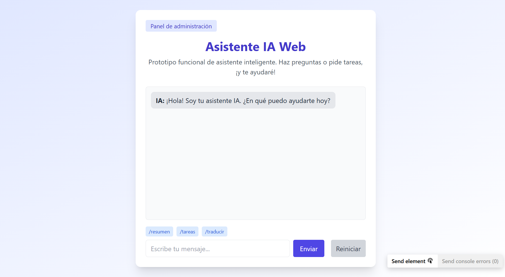
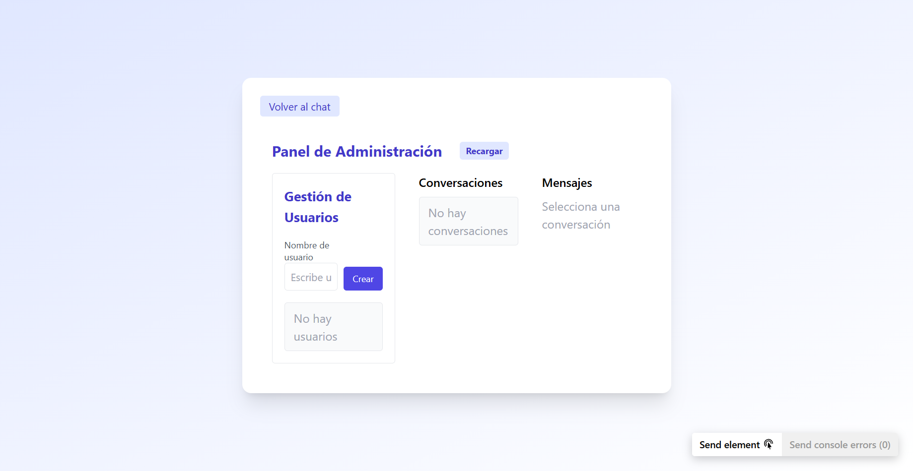

# Asistente Virtual IA — Prototipo Web

Un asistente virtual conversacional con historial, comandos especiales y panel de administración, desarrollado como prototipo funcional usando **React**, **FastAPI** y **SQLite**.

---

## Estructura del proyecto
- `backend/`: API REST en FastAPI (Python)
- `frontend/`: SPA en React + Tailwind CSS
- `screenshots/`: Capturas usadas en el README

---

## 🚀 Instalación y Ejecución

### Backend (FastAPI + SQLite)

```sh
cd backend
python -m venv venv
source venv/bin/activate  # En Windows: venv\Scripts\activate
pip install -r requirements.txt
# Crea el archivo .env si es necesario (ver .env.example)
uvicorn main:app --reload
```
- El backend corre en `http://localhost:8000`

### Frontend (React + Vite + Tailwind)

```sh
cd frontend
npm install
npm run dev
```
- El frontend corre en `http://localhost:5173`

### Docker Compose (opcional)

```bash
docker-compose up --build
```

---

## 🔌 Integración real con DeepSeek (HuggingFace)

1. Regístrate en [HuggingFace](https://huggingface.co/join) si no tienes cuenta.
2. Ve a [https://huggingface.co/settings/tokens](https://huggingface.co/settings/tokens) y crea un Access Token (tipo "Read").
3. Copia el archivo `.env.example` a `.env` en la carpeta `backend` y pega tu token en `DEEPSEEK_API_KEY`.
   ```env
   DEEPSEEK_API_URL=https://api-inference.huggingface.co/models/deepseek-ai/deepseek-llm-7b-chat
   DEEPSEEK_API_KEY=tu_token_de_huggingface
   ```
4. Reinicia el backend. Ahora las respuestas del chat vendrán realmente de DeepSeek (si hay cuota disponible en HuggingFace).

---

## 🏗️ Arquitectura General

- **Frontend:** React SPA, Tailwind CSS, Vite.
  - Página de bienvenida, área de chat, historial, comandos rápidos y panel de administración.
- **Backend:** FastAPI, SQLModel, SQLite.
  - API RESTful, persistencia de usuarios, conversaciones y mensajes.
  - Lógica de control de contexto para IA.
- **Persistencia:** SQLite (archivo local).
- **Panel de Administración:** CRUD de usuarios, conversaciones y mensajes.

### Diagrama Simplificado

```
[Usuario] ⇄ [React SPA] ⇄ [FastAPI API] ⇄ [SQLite DB]
```

---

## ✨ Funcionalidades

- Interfaz web responsive y moderna.
- Página de bienvenida.
- Área de chat con historial y botón para reiniciar.
- Asistente virtual conectado a modelo IA (simulación LLaMA2, fácil de adaptar a OpenAI, etc).
- Comandos especiales:
  - `/resumen` — resumen de la conversación.
  - `/tareas` — genera lista de tareas.
  - `/traducir` — traducción dummy.
  - `/buscar` — búsqueda web simulada (resultados dummy).
- Panel de administración:
  - Gestión de usuarios (crear, editar, eliminar).
  - Gestión de conversaciones y mensajes.
- Control de contexto: la IA responde considerando solo los últimos 10 mensajes + resumen del historial previo.

---

## 🛠️ Decisiones de Stack y Arquitectura

- **FastAPI**: API moderna, rápida y fácil de documentar.
- **React + Tailwind**: SPA ágil, componentes reutilizables y estilo profesional.
- **SQLite**: Persistencia simple, ideal para prototipos y pruebas locales.
- **Lógica de contexto**: Implementada en backend para respuestas coherentes y eficientes.
- **Panel de administración**: Facilita pruebas y gestión de datos desde la web.

---

## 🧩 Desafíos y Soluciones

- **Gestión de contexto**: Se implementó un control para limitar el historial enviado al modelo y evitar prompts demasiado largos.
- **Persistencia**: Uso de SQLite y SQLModel para CRUD sencillo y portable.
- **Comandos especiales**: Añadidos para enriquecer la experiencia y simular capacidades avanzadas.
- **Simulación IA**: El backend está preparado para conectar fácilmente con una API real (LLaMA2, OpenAI, etc).

---

## 📝 Capturas de pantalla

### Página principal y chat


### Panel de administración y funcionalidades extra


---

## 🐳 Docker (opcional)

### Backend

```sh
cd backend
docker build -t ia-assistant-backend .
docker run -p 8000:8000 ia-assistant-backend
```

### Frontend

```sh
cd frontend
docker build -t ia-assistant-frontend .
docker run -p 5173:5173 ia-assistant-frontend
```

---

## 🌐 Deploy

Puedes desplegar el frontend fácilmente en Netlify, Vercel o similar. El backend puede desplegarse en Render, Railway, etc.

---

## 📄 Licencia

MIT

---
docker-compose up --build
```

- El frontend estará disponible en: http://localhost:3000
- El backend (API) en: http://localhost:8000

### Backend (modo manual)

**Requisitos previos:**
- Python 3.12 o superior

1. Copia el archivo `.env.example` a `.env` en la carpeta `backend` y configura tu API key de HuggingFace.
2. Instala dependencias y ejecuta:

```bash
cd backend
pip install -r requirements.txt
uvicorn main:app --reload --host 0.0.0.0 --port 8000
```

#### Integración real con DeepSeek (HuggingFace)

1. **Regístrate en [HuggingFace](https://huggingface.co/join)** si no tienes cuenta.
2. Ve a [https://huggingface.co/settings/tokens](https://huggingface.co/settings/tokens) y crea un Access Token (tipo "Read").
3. Copia el archivo `.env.example` a `.env` en la carpeta `backend` y pega tu token en `DEEPSEEK_API_KEY`.
   ```env
   DEEPSEEK_API_URL=https://api-inference.huggingface.co/models/deepseek-ai/deepseek-llm-7b-chat
   DEEPSEEK_API_KEY=tu_token_de_huggingface
   ```
4. Instala las dependencias si no lo has hecho:
   ```bash
   pip install -r requirements.txt
   ```
5. Reinicia el backend. Ahora las respuestas del chat vendrán realmente de LLaMA 2 (si hay cuota disponible en HuggingFace).

### Frontend
```bash
cd frontend
npm install
npm run dev
```

## ✨ Características principales
- Página de bienvenida
- Chat con historial y botón para reiniciar
- Asistente virtual con IA real usando DeepSeek (HuggingFace) o simulación local
- Comandos especiales: `/resumen`, `/tareas`, `/traducir`, `/buscar`
- Panel de administración (CRUD de usuarios, conversaciones y mensajes)
- Control de contexto para respuestas coherentes
- Dockerfile para backend y frontend (opcional)

## 🛠️ Stack y arquitectura
- **FastAPI**: API REST moderna, fácil de prototipar
- **React + Vite + Tailwind**: SPA moderna y responsive
- **SQLite**: Persistencia simple y portable

## 🧩 Desafíos y soluciones
- Garantizar estructura limpia y extensible
- Simulación IA para facilitar pruebas sin depender de API externas
- Control de contexto para mantener coherencia en las respuestas

